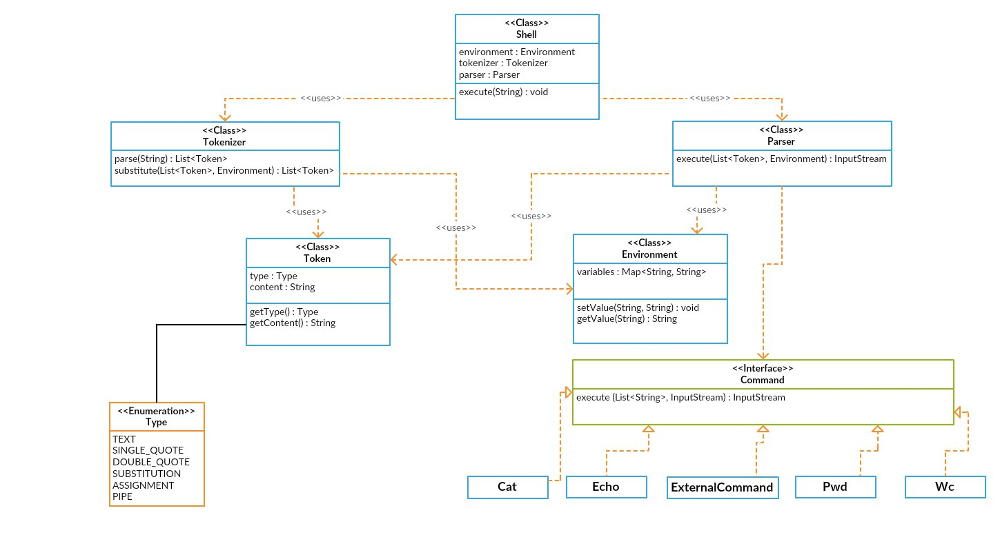

# Shell

## Описание классов

* **Token**: единица токенизации, имеет тип и строковое значение 
* **Environment**: отвечает за хранение названий переменных окружения и их значений
* **Tokenizer**: выполняет токенизацию входной строки и подстановку значений переменных
* **Parser**: отвечает за группировку токенов по командам и за выполнение этих команд
* **Command**: интерфейс, который реализуют все поддерживаемые команды
* **Shell**: main-класс 

## Диаграмма

## Удобство данной реализации

Для добавления новой команды достаточно реализовать интерфейс Command(одна функция - execute) и добавить ее название в список поддерживаемых. 
